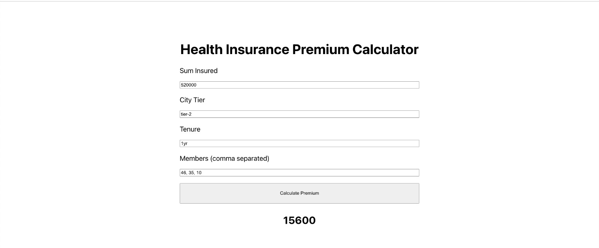

# Health Insurance Premium Calculator



## Backend
To run backend, python 3 version is needed to be installed
- To install packages:
    ```sh
    cd backend
    pip install Flask
    pip install flask-cors
    ```
- To run the backend:
    ```sh
    cd backend
    python app.py
    ```
- The server will launch at `http://localhost:8080`

### API
Here is the API detail:
- URL
    ```pre
    POST http://localhost:8080/calculate_premium
    ```
- Request Body
    ```json
    {
        "sum_insured": 500000,
        "city_tier": "tier-1",
        "tenure": "1yr",
        "member_ages": [
            10,
            35,
            10
        ]
    }
    ```
- Response
    ```json
    {
        "premium": 23400.0
    }
    ```

# Frontend
To run frontend, Node v14 is required to be installed
- To install packages:
    ```sh
    cd frontend
    npm install
    ```
- To run the frontend:
    ```sh
    npm start
    ```
- The server will launch at `http://localhost:3000`
